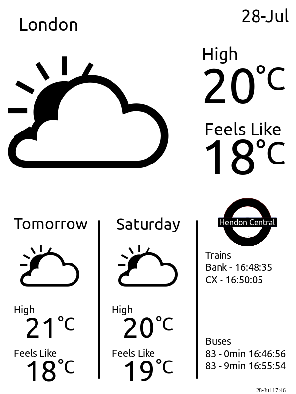

# Catch That Bus / Train

*Ever wanted to know if you needed to run to catch that bus or train...no, well I did! :D*

A simple ambient display to show bus and train times for a local stop, with weather info to let you know if you need an jacket on the way out.

Uses a kindle display to non-intrusively show info and looks great on its non-backlit e-paper display.

Written in Python utilising the MetOffice and TfL open data APIs to grab weather and transport information, respectively.

Inspired by and based on a weather kindle display by Matthew Petroff - [linky](http://www.mpetroff.net/)

### Usage

1. Create a secrets.py and add in your API keys
2. Update the weather location, train and bus stops
3. Modify the cronscript to drop the final image in your webserver
4. Jailbreak your kindle and make it point to your webserver

### Example image

